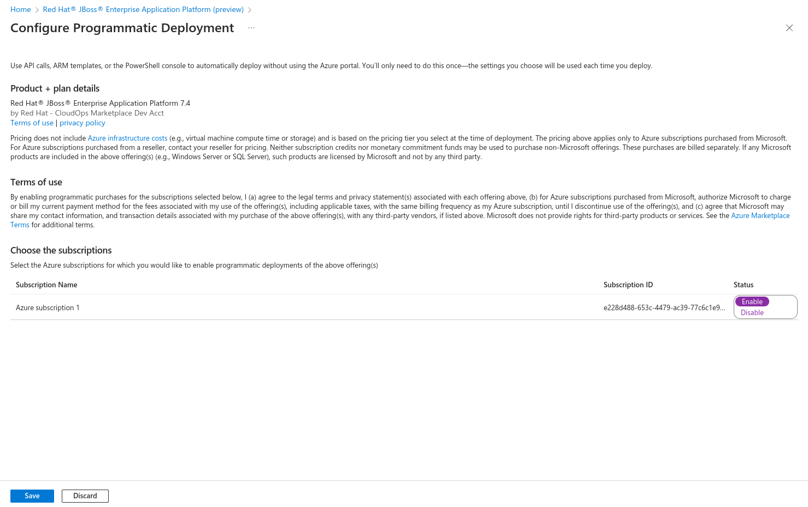

# Deploying EAP on Azure with the Azure CLI

From the Azure Marketplace, navigate to the JBoss EAP offer and click on "Get It Now".

Complete the software plan form, and click on "Continue"

Login to Azure with your Microsoft account.

From the configuration page click on "Get Started" following "Want to deploy programmatically" 

Ensure Status is set to "Enable" for your active subscription

## Azure CLI Commands

Login to Azure using the Azure CLI

`az login`

Create a resource group

`az group create --resource-group eap --location eastus`

Set an admin password

`export PASSWORD=<your password>`

Deploy an instance of JBoss EAP on a virtual machine

`az deployment group create --resource-group eap --template-file ./SaaS-ARM.json --parameters ./parameters.json --parameters adminPassword=$PASSWORD`

Once the deployment is complete, find the public IP address

`az network public-ip show -n eap-ip --resource-group eap --query "ipAddress"`

Store the IP address in an environment variable

`IP_ADDRESS=$(az network public-ip show -n eap-ip --resource-group eap --query "ipAddress" | tr -d '"')`

Login to the virtual machine using SSH

`ssh admin-user@$IP_ADDRESS`

Enter the password you seet previously

Switch to root user

`sudo su -`

Start JBoss EAP

`systemctl start eap7-standalone`

Point your browser to the public IP address on port 8080

## Cleanup

Delete the eap resource group

`az group delete -n eap`